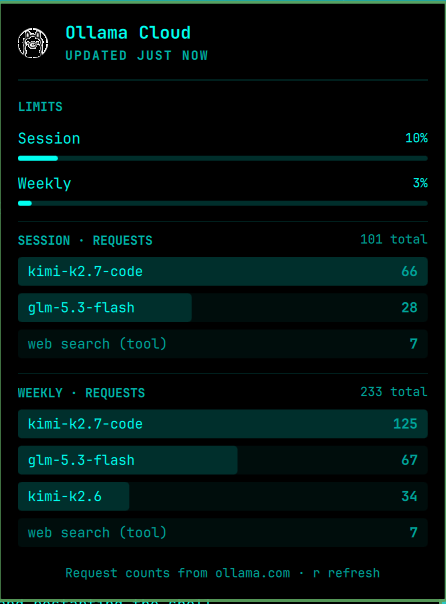

# Ollama Cloud Usage for the Omarchy bar

A small Omarchy bar widget that shows how much of your **Ollama Cloud** plan
you've used: the session and weekly limit meters, and how many requests each
model made in each window. The numbers come straight from your ollama.com
account, so they include usage from every machine and tool, not just this one.



## What you get

- **Bar icon** (󱚤 by default). It turns the alert color when any window
  passes 90%. Hover for a one-line summary.
- **Panel** (click the icon):
  - **Limits:** session and weekly usage, as a percentage and a meter.
  - **Session · requests** and **Weekly · requests:** each model with its
    request count, bars scaled to the busiest model. Tools such as web search
    are listed after the models and marked "(tool)".
  - A header showing when the numbers were last updated, and a red card if
    something is wrong (missing or rejected key, ollama.com unreachable).

**Not shown:** reset times. ollama.com's usage API doesn't provide them.

## Requirements

- Omarchy with the Quickshell-based `omarchy-shell` bar (tested on Omarchy 4.0.3).
- An Ollama Cloud account and an API key from <https://ollama.com/settings/keys>.
- `python3` on `PATH`, standard library only; no pip packages.
- Network access to `https://ollama.com`. The widget calls one endpoint,
  `GET /api/usage`, with your key as a Bearer token.
- `timeout` from coreutils, and `xdg-open` for the right-click shortcut.
  Both ship with Omarchy.

The plugin needs no browser, cookies or root access, and it doesn't change
any Omarchy configuration beyond the bar entry that `omarchy plugin` manages.

## Setup

1. Create an API key at <https://ollama.com/settings/keys>.
2. Save it:
   ```bash
   mkdir -p -m 700 ~/.config/omarchy/ollama-usage
   echo 'YOUR_KEY' > ~/.config/omarchy/ollama-usage/api.key
   chmod 600 ~/.config/omarchy/ollama-usage/api.key
   ```
   (Or set `OLLAMA_API_KEY` in the environment the shell runs in.)
3. Install and enable the plugin:
   ```bash
   omarchy plugin add https://github.com/bresleveloper-ai-agents/omarchy-ollama-cloud-usage-bar-widget.git --enable
   omarchy bar move io.github.bresleveloper.ollama-cloud-usage-bar-widget --section right   # if it didn't land where you want
   ```
   The plugin must be a real folder under `~/.config/omarchy/plugins/`, not a
   symlink, or edits won't hot-reload. See [DETAILS.md](DETAILS.md).

## Using it

| Action | What it does |
|---|---|
| Left click | Open / close the panel |
| Middle click | Refresh now |
| Right click | Open ollama.com/settings in the browser |
| `r` or Enter (panel open) | Refresh now |
| `j` / `k` | Scroll |
| Tab | Move to the neighboring bar panel |
| Esc | Close |

From a terminal: `omarchy-shell io.github.bresleveloper.ollama-cloud-usage-bar-widget refresh|open|close|toggle`.

The widget refreshes every 15 minutes, and when you open the panel (at most
once a minute).

## Settings

Set with `omarchy bar set io.github.bresleveloper.ollama-cloud-usage-bar-widget <key> <value>`:

| Key | Default | Meaning |
|---|---|---|
| `refreshIntervalSec` | `900` | Seconds between checks (minimum 60). Use `--json` so it's stored as a number. |
| `icon` | `󱚤` | Any Nerd Font glyph for the bar. |
| `showPercent` | `"Off"` | `"On"` shows the fullest window's % next to the icon. |

## Files

- Key: `~/.config/omarchy/ollama-usage/api.key`
- Latest data: `~/.local/state/omarchy/ollama-usage/usage.json`
- Run the data fetch by hand: `python3 collect.py --force`

## Remove

```bash
omarchy plugin remove io.github.bresleveloper.ollama-cloud-usage-bar-widget
```

This removes the plugin and its bar entry. Your key and cached data stay in
place. To delete them as well:

```bash
rm -r ~/.config/omarchy/ollama-usage ~/.local/state/omarchy/ollama-usage
```

## Author

bresleveloper (ariel.rubi@gmail.com), with Claude Opus 5.5

## Credits

The Ollama mark in `assets/` comes from
[GePi0/omarchy-ai-usage](https://github.com/GePi0/omarchy-ai-usage) (MIT). The
Ollama logo is Ollama's trademark. The panel layout follows Omarchy's built-in
Agents widget.
